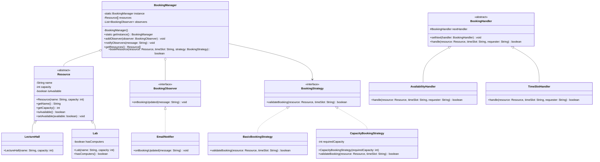

```mermaid
classDiagram
    class Resource {
        <<abstract>>
        -String name
        -int capacity
        -boolean isAvailable
        +Resource(name: String, capacity: int)
        +getName() String
        +getCapacity() int
        +isAvailable() boolean
        +setAvailable(available: boolean) void
    }

    class LectureHall {
        +LectureHall(name: String, capacity: int)
    }

    class Lab {
        -boolean hasComputers
        +Lab(name: String, capacity: int)
        +hasComputers() boolean
    }

    class BookingManager {
        -static BookingManager instance
        -Resource[] resources
        -List~BookingObserver~ observers
        -BookingManager()
        +static getInstance() BookingManager
        +addObserver(observer: BookingObserver) void
        +notifyObservers(message: String) void
        +getResources() Resource[]
        +bookResource(resource: Resource, timeSlot: String, strategy: BookingStrategy) boolean
    }

    class BookingStrategy {
        <<interface>>
        +validateBooking(resource: Resource, timeSlot: String) boolean
    }

    class BasicBookingStrategy {
        +validateBooking(resource: Resource, timeSlot: String) boolean
    }

    class CapacityBookingStrategy {
        -int requiredCapacity
        +CapacityBookingStrategy(requiredCapacity: int)
        +validateBooking(resource: Resource, timeSlot: String) boolean
    }

    class BookingHandler {
        <<abstract>>
        #BookingHandler nextHandler
        +setNext(handler: BookingHandler) void
        +handle(resource: Resource, timeSlot: String, requester: String) boolean
    }

    class AvailabilityHandler {
        +handle(resource: Resource, timeSlot: String, requester: String) boolean
    }

    class TimeSlotHandler {
        +handle(resource: Resource, timeSlot: String, requester: String) boolean
    }

    class BookingObserver {
        <<interface>>
        +onBookingUpdated(message: String) void
    }

    class EmailNotifier {
        +onBookingUpdated(message: String) void
    }

    Resource <|-- LectureHall
    Resource <|-- Lab
    BookingStrategy <|.. BasicBookingStrategy
    BookingStrategy <|.. CapacityBookingStrategy
    BookingHandler <|-- AvailabilityHandler
    BookingHandler <|-- TimeSlotHandler
    BookingObserver <|.. EmailNotifier
    BookingManager o-- Resource
    BookingManager o-- BookingObserver
    BookingManager --> BookingStrategy
```
