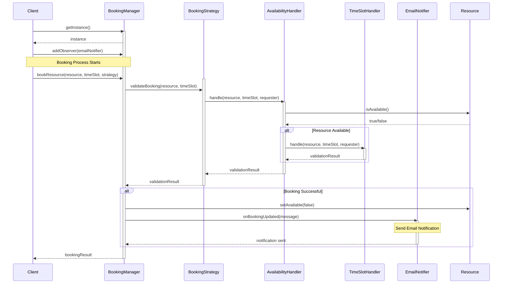

```mermaid
sequenceDiagram
    participant Client
    participant BookingManager
    participant BookingStrategy
    participant AvailabilityHandler
    participant TimeSlotHandler
    participant EmailNotifier
    participant Resource

    Client->>BookingManager: getInstance()
    activate BookingManager
    BookingManager-->>Client: instance
    
    Client->>BookingManager: addObserver(emailNotifier)
    
    Note over Client,BookingManager: Booking Process Starts
    Client->>BookingManager: bookResource(resource, timeSlot, strategy)
    activate BookingStrategy
    BookingManager->>BookingStrategy: validateBooking(resource, timeSlot)
    
    BookingStrategy->>AvailabilityHandler: handle(resource, timeSlot, requester)
    activate AvailabilityHandler
    AvailabilityHandler->>Resource: isAvailable()
    Resource-->>AvailabilityHandler: true/false
    
    alt Resource Available
        AvailabilityHandler->>TimeSlotHandler: handle(resource, timeSlot, requester)
        activate TimeSlotHandler
        TimeSlotHandler-->>AvailabilityHandler: validationResult
        deactivate TimeSlotHandler
    end
    
    AvailabilityHandler-->>BookingStrategy: validationResult
    deactivate AvailabilityHandler
    
    BookingStrategy-->>BookingManager: validationResult
    deactivate BookingStrategy
    
    alt Booking Successful
        BookingManager->>Resource: setAvailable(false)
        BookingManager->>EmailNotifier: onBookingUpdated(message)
        activate EmailNotifier
        Note over EmailNotifier: Send Email Notification
        EmailNotifier-->>BookingManager: notification sent
        deactivate EmailNotifier
    end
    
    BookingManager-->>Client: bookingResult
    deactivate BookingManager
```
